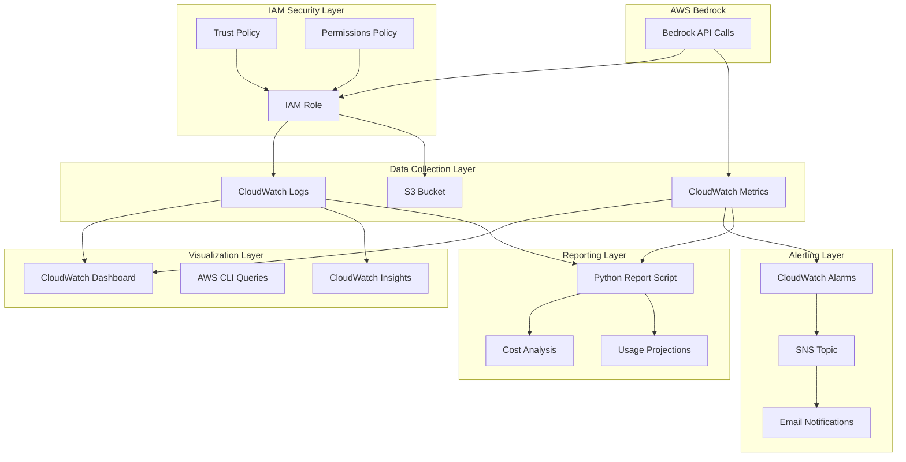

# Design Document: AWS Bedrock Monitoring System

## Overview

The AWS Bedrock Monitoring System is a comprehensive observability solution that provides real-time visibility into Claude API usage, performance metrics, cost tracking, and operational health. The system leverages AWS CloudWatch for metrics and logging, S3 for log archival, and SNS for alerting to create a complete monitoring infrastructure.

The design follows a modular approach with six distinct components that can be deployed incrementally: IAM setup, S3 storage, logging configuration, dashboard creation, alerting, and reporting. Each component is implemented as a standalone script that handles existing resources gracefully and can be run independently or as part of the complete setup sequence.

## Architecture

The monitoring system follows a hub-and-spoke architecture with CloudWatch as the central observability hub:



### Data Flow Architecture

1. **Ingestion**: Bedrock API calls generate metrics and logs automatically
2. **Collection**: CloudWatch collects metrics; IAM role enables log delivery
3. **Storage**: Logs stored in CloudWatch (30 days) and S3 (90 days with lifecycle)
4. **Processing**: Real-time metrics aggregation and log parsing
5. **Visualization**: Dashboard displays metrics; Insights enables custom queries
6. **Alerting**: Alarms monitor thresholds and send SNS notifications
7. **Reporting**: Python script generates usage and cost analysis reports

## Components and Interfaces

### 1. IAM Security Component

**Purpose**: Establishes secure access permissions for Bedrock logging integration.

**Key Interfaces**:
- `create_iam_role()`: Creates BedrockCloudWatchLoggingRole with minimal permissions
- `attach_trust_policy()`: Restricts role assumption to Bedrock service only
- `attach_permissions_policy()`: Grants CloudWatch and S3 write permissions

**Security Design**:
- Principle of least privilege with resource-specific ARNs
- Account-specific conditions to prevent cross-account access
- Source ARN conditions to limit Bedrock service access

### 2. Storage Management Component

**Purpose**: Manages log storage with cost-effective retention policies.

**Key Interfaces**:
- `create_s3_bucket()`: Creates account-specific bucket with versioning
- `configure_lifecycle_policy()`: Implements 90-day automatic deletion
- `set_cloudwatch_retention()`: Configures 30-day CloudWatch log retention

**Storage Strategy**:
- CloudWatch for real-time access and querying (30 days)
- S3 for long-term archival and large payloads (90 days)
- Automatic routing based on payload size (>256KB to S3)

### 3. Logging Configuration Component

**Purpose**: Enables comprehensive Bedrock API call logging.

**Key Interfaces**:
- `enable_model_invocation_logging()`: Activates Bedrock logging with dual destinations
- `configure_log_delivery()`: Sets up CloudWatch and S3 delivery targets
- `set_data_types()`: Specifies text, image, and embedding data capture

**Logging Design**:
- Full request/response logging for debugging and analysis
- Metadata capture: model ID, tokens, latency, timestamps
- Dual delivery ensures availability and cost optimization

### 4. Dashboard and Visualization Component

**Purpose**: Provides real-time visual monitoring of Bedrock usage and performance.

**Key Interfaces**:
- `create_dashboard()`: Builds BedrockUsageMonitoring dashboard with key metrics
- `configure_metric_widgets()`: Sets up invocation, token, and latency graphs
- `add_log_viewer()`: Integrates recent invocations log display

**Dashboard Design**:
- Time-series graphs for usage trends and performance monitoring
- Multi-model comparison views for resource allocation decisions
- Real-time log streaming for immediate issue identification

### 5. Alerting and Notification Component

**Purpose**: Provides automated monitoring and notification for threshold breaches.

**Key Interfaces**:
- `create_cloudwatch_alarms()`: Sets up four critical monitoring alarms
- `configure_sns_topic()`: Creates notification distribution system
- `set_alarm_thresholds()`: Defines usage, error, and performance limits

**Alerting Strategy**:
- Proactive monitoring of cost, performance, and reliability metrics
- Configurable thresholds for different operational environments
- Email-based notifications with alarm context and recommended actions

### 6. Reporting and Analysis Component

**Purpose**: Generates detailed usage reports and cost projections.

**Key Interfaces**:
- `generate_usage_report()`: Creates comprehensive usage analysis for specified periods
- `calculate_cost_estimates()`: Provides model-specific cost breakdowns
- `project_monthly_usage()`: Extrapolates trends for budget planning

**Reporting Features**:
- Multi-model usage comparison (Sonnet, Opus, Haiku)
- Token-based cost calculations with current pricing
- Performance analytics including latency percentiles

## Data Models

### CloudWatch Metrics Schema

```typescript
interface BedrockMetrics {
  namespace: "AWS/Bedrock"
  metrics: {
    Invocations: {
      unit: "Count"
      dimensions: ["ModelId"]
    }
    InputTokenCount: {
      unit: "Count" 
      dimensions: ["ModelId"]
    }
    OutputTokenCount: {
      unit: "Count"
      dimensions: ["ModelId"] 
    }
    InvocationLatency: {
      unit: "Milliseconds"
      dimensions: ["ModelId"]
    }
  }
}
```

### CloudWatch Logs Schema

```typescript
interface BedrockLogEntry {
  timestamp: string
  requestId: string
  modelId: string
  inputTokenCount: number
  outputTokenCount: number
  invocationLatency: number
  input: {
    inputBodyJson: string
  }
  output: {
    outputBodyJson: string
  }
  metadata: {
    region: string
    accountId: string
  }
}
```

### Usage Report Data Model

```typescript
interface UsageReport {
  period: {
    startTime: string
    endTime: string
    durationHours: number
  }
  summary: {
    totalInvocations: number
    totalInputTokens: number
    totalOutputTokens: number
    estimatedCost: number
  }
  byModel: {
    [modelId: string]: {
      invocations: number
      inputTokens: number
      outputTokens: number
      cost: number
      avgLatency: number
    }
  }
  projections: {
    monthlyInvocations: number
    monthlyCost: number
  }
  performance: {
    avgLatency: number
    p99Latency: number
    errorCount: number
    errorRate: number
  }
}
```

### Configuration Data Model

```typescript
interface MonitoringConfiguration {
  iam: {
    roleName: string
    roleArn: string
    accountId: string
  }
  storage: {
    s3BucketName: string
    cloudwatchLogGroup: string
    retentionDays: number
  }
  alerting: {
    snsTopicArn: string
    thresholds: {
      highTokenUsage: number
      errorRate: number
      invocationSpike: number
      highLatency: number
    }
  }
  dashboard: {
    name: string
    region: string
  }
}
```

Now I need to use the prework tool to analyze the acceptance criteria before writing the correctness properties:

<function_calls>
<invoke name="prework">
<parameter name="featureName">aws-bedrock-monitoring

## Correctness Properties

*A property is a characteristic or behavior that should hold true across all valid executions of a system—essentially, a formal statement about what the system should do. Properties serve as the bridge between human-readable specifications and machine-verifiable correctness guarantees.*

Based on the prework analysis, I've identified several properties that can be combined for more comprehensive validation while eliminating redundancy:

### Property Reflection

After reviewing all testable acceptance criteria, I've identified opportunities to consolidate related properties:

- IAM permission properties (1.1, 1.3, 1.4) can be combined into a comprehensive IAM policy validation property
- Storage configuration properties (2.2, 2.3, 2.4, 2.5) can be consolidated into a storage setup validation property  
- Logging configuration properties (3.1, 3.3, 3.4, 3.5) can be merged into a comprehensive logging configuration property
- Dashboard widget properties (4.1, 4.2, 4.3, 4.4, 4.5) can be combined into a dashboard completeness property
- Alarm configuration properties (5.1, 5.2, 5.3, 5.4, 5.5) can be consolidated into an alerting system property
- Report generation properties (6.1, 6.2, 6.3, 6.4, 6.5) can be merged into a comprehensive reporting property

### Property 1: IAM Role Security Configuration
*For any* AWS account and monitoring system deployment, the created IAM role should contain only the minimal required permissions for CloudWatch logging and S3 access, with a trust policy that restricts access to the Bedrock service and specific account resources.
**Validates: Requirements 1.1, 1.2, 1.3, 1.4, 1.5**

### Property 2: Storage Configuration Completeness  
*For any* monitoring system deployment, the storage configuration should include an S3 bucket with account-specific naming, versioning enabled, 90-day lifecycle policy, and CloudWatch log group with 30-day retention.
**Validates: Requirements 2.2, 2.3, 2.4, 2.5**

### Property 3: Bedrock Logging Configuration Integrity
*For any* logging configuration setup, the system should enable model invocation logging with text data delivery to both CloudWatch and S3 destinations using the correct log group name.
**Validates: Requirements 3.1, 3.3, 3.4, 3.5**

### Property 4: Dashboard Widget Completeness
*For any* dashboard configuration, the dashboard should include all required widgets for invocations, input/output tokens, latency metrics (average and p99), error tracking, and recent log viewing.
**Validates: Requirements 4.1, 4.2, 4.3, 4.4, 4.5**

### Property 5: Alerting System Configuration
*For any* alerting system setup, all four required alarms (high token usage at 100k/hour, error rate at 10/5min, invocation spike at 1000/hour, high latency at 10s) should be configured and connected to the SNS topic for notifications.
**Validates: Requirements 5.1, 5.2, 5.3, 5.4, 5.5**

### Property 6: Usage Report Completeness
*For any* usage report generation with a specified time period, the report should include total invocations and tokens, model-specific breakdowns, cost estimates with current pricing, performance statistics, and monthly projections.
**Validates: Requirements 6.1, 6.2, 6.3, 6.4, 6.5**

### Property 7: Script Error Handling
*For any* setup script execution when resources already exist, the script should detect existing resources and continue without errors rather than failing.
**Validates: Requirements 7.2**

### Property 8: Command Line Interface Validation
*For any* usage report script invocation, the script should accept time period parameters in hours and generate reports for the specified duration.
**Validates: Requirements 7.3**

### Property 9: Cleanup Script Completeness
*For any* cleanup script execution, the script should identify and remove all monitoring resources (IAM role, S3 bucket, log groups, dashboard, alarms, SNS topic) that were created during setup.
**Validates: Requirements 7.5**

## Error Handling

### IAM and Permissions Errors
- **Existing Role Handling**: Scripts detect existing IAM roles and update policies rather than failing
- **Permission Validation**: Verify role permissions before proceeding with dependent operations
- **Cross-Account Protection**: Trust policies prevent unauthorized cross-account access

### Storage and Logging Errors  
- **Bucket Conflicts**: Handle existing S3 buckets gracefully with configuration validation
- **Log Group Management**: Create log groups if they don't exist, update retention if they do
- **Delivery Failures**: AWS Bedrock retries log delivery for up to 24 hours on transient failures

### Dashboard and Alerting Errors
- **Widget Validation**: Verify metric availability before creating dashboard widgets
- **Alarm Dependencies**: Ensure SNS topic exists before creating alarms
- **Notification Failures**: SNS provides built-in retry and dead letter queue capabilities

### Reporting and CLI Errors
- **Data Availability**: Handle cases where metrics or logs are not yet available
- **Time Range Validation**: Validate time period parameters and provide meaningful error messages
- **API Rate Limiting**: Implement exponential backoff for CloudWatch API calls

### Recovery Strategies
- **Partial Deployment Recovery**: Each script can be run independently to fix specific components
- **Configuration Drift Detection**: Scripts validate existing resources match expected configuration
- **Rollback Capability**: Cleanup scripts provide complete environment reset capability

## Testing Strategy

### Dual Testing Approach

The testing strategy employs both unit testing and property-based testing to ensure comprehensive coverage:

**Unit Tests**: Verify specific examples, edge cases, and error conditions
- Test individual script functions with known inputs and expected outputs
- Validate error handling for common failure scenarios (permissions, existing resources)
- Test CLI argument parsing and validation logic
- Verify configuration file generation and AWS API call formatting

**Property Tests**: Verify universal properties across all inputs  
- Test that IAM policies always contain minimal required permissions regardless of account ID
- Verify storage configurations always include required settings across different regions
- Ensure dashboard configurations always contain all required widgets regardless of customization
- Validate that cleanup scripts always remove all created resources regardless of deployment state

### Property-Based Testing Configuration

**Testing Framework**: Use Hypothesis for Python-based property testing
- Minimum 100 iterations per property test to ensure comprehensive input coverage
- Each property test references its corresponding design document property
- Tag format: **Feature: aws-bedrock-monitoring, Property {number}: {property_text}**

**Test Data Generation**:
- Generate random AWS account IDs, regions, and resource names
- Create varied configuration scenarios (different retention periods, alarm thresholds)
- Test with different AWS service responses (success, failure, partial success)
- Generate edge cases (empty responses, malformed JSON, network timeouts)

### Integration Testing Strategy

**End-to-End Validation**:
- Deploy complete monitoring system in test AWS account
- Generate synthetic Bedrock API calls to validate log collection
- Verify dashboard displays real metrics and logs
- Trigger alarms and validate SNS notifications
- Generate usage reports and validate accuracy against known usage

**Cross-Component Testing**:
- Test script execution order and dependencies
- Validate that each component properly uses outputs from previous components
- Ensure cleanup scripts can remove resources created by setup scripts
- Test partial deployment scenarios and recovery procedures

### Performance and Scale Testing

**Load Testing**:
- Test dashboard performance with high-volume metrics (1000+ invocations/hour)
- Validate log processing with large payloads (>256KB responses)
- Test alarm responsiveness under sustained threshold breaches
- Verify report generation performance with 30+ day time ranges

**Cost Optimization Testing**:
- Validate lifecycle policies actually delete old logs
- Test S3 storage class transitions for cost optimization
- Verify CloudWatch log retention policies are enforced
- Test alarm evaluation frequency to minimize CloudWatch costs