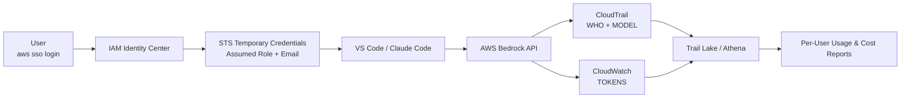
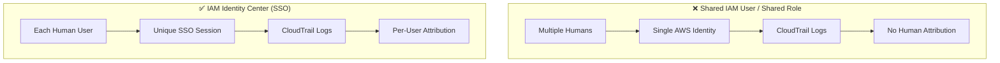
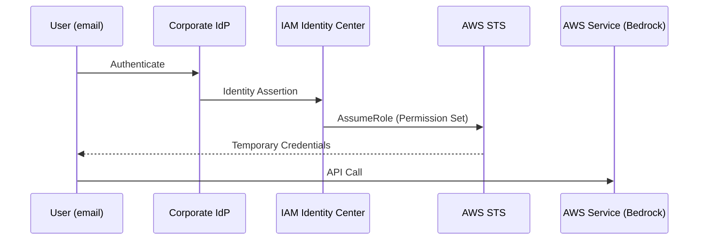
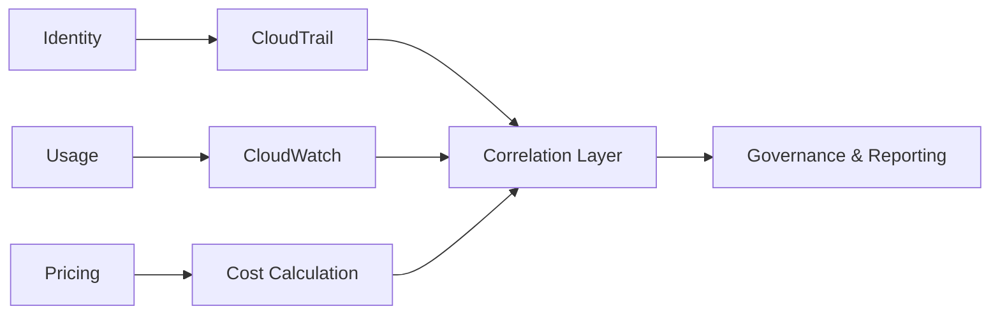
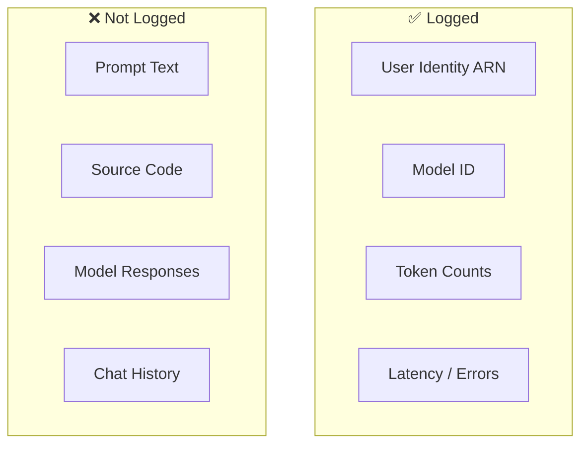
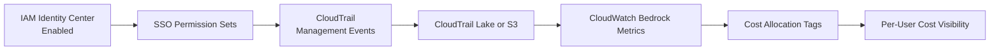
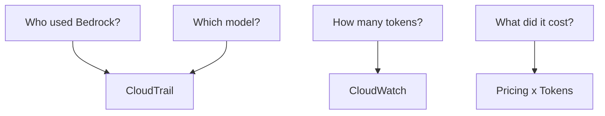

# Appendix: Diagrams — AWS Bedrock Traceability (Users, Tokens, Cost)

**Purpose:** Visual-only appendix to support the *AWS Bedrock Traceability Runbook*.  
**Audience:** AWS Admins, Security, Architecture, Executives  
**Note:** This appendix contains **diagrams only** (no prose) for easy presentation and reuse.

---

## A1. End-to-End Traceability Flow (WHO + HOW MUCH + COST)



---

## A2. Identity Model: Shared vs SSO (Critical Difference)



---

## A3. How the Assumed-Role ARN Is Formed



**Resulting ARN format:**
```
arn:aws:sts::<account-id>:assumed-role/AWSReservedSSO_<PermissionSet>/<user@company.com>
```

---

## A4. Separation of Concerns (Governance-Friendly)



---

## A5. What Is and Is NOT Logged



---

## A6. Minimum Viable Admin Configuration (Visual Checklist)



---

## A7. Incident / Audit Question Mapping



---

**End of Diagram Appendix**
