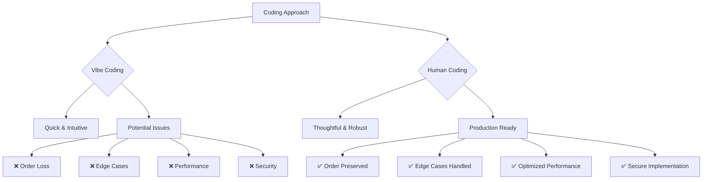
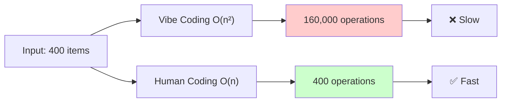
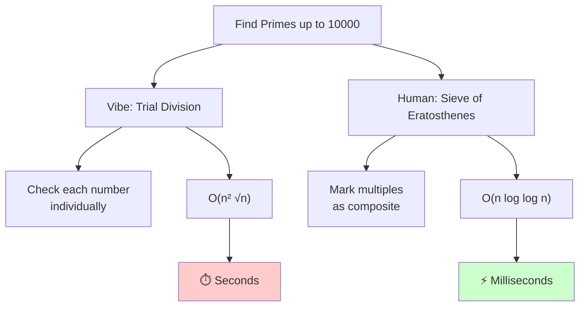
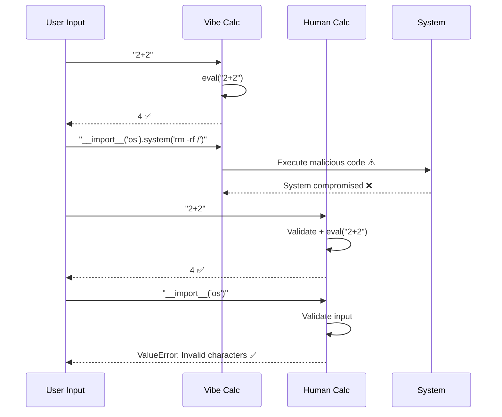

# Example 1: Vibe Coding vs Human Coding

This script demonstrates common pitfalls when using "vibe coding" (quick, intuitive solutions) compared to careful "human coding" (thoughtful, robust solutions).

## Overview

The script contains 5 examples that highlight where fast, intuitive coding fails and why careful consideration is important for production code.



## Examples

### Example 1: Order Preservation Bug
- **Problem**: Merging two lists and removing duplicates
- **Vibe Coding Flaw**: Using `set()` loses insertion order
- **Human Solution**: Manual iteration with a set to track seen items while preserving order

### Example 2: Edge Case Handling
- **Problem**: Calculating the average of a list of numbers
- **Vibe Coding Flaw**: Crashes with `ZeroDivisionError` on empty lists
- **Human Solution**: Defensive programming with proper edge case handling

### Example 3: Performance Issues
- **Problem**: Finding duplicate items in a list
- **Vibe Coding Flaw**: O(n²) nested loops - slow for large datasets
- **Human Solution**: O(n) hash map approach for efficient duplicate detection
- **Performance**: Human version is significantly faster on large datasets



### Example 4: Prime Number Generation
- **Problem**: Finding all prime numbers up to n
- **Vibe Coding Flaw**: O(n² √n) trial division for each number
- **Human Solution**: O(n log log n) Sieve of Eratosthenes algorithm
- **Performance**: Human version is dramatically faster (orders of magnitude)



### Example 5: Security Vulnerability
- **Problem**: Building a simple calculator
- **Vibe Coding Flaw**: Using `eval()` without validation allows code injection attacks
- **Human Solution**: Input validation to block malicious code execution



## Running the Script

```bash
# From repository root
python examples/01-vibe-vs-human/example-1.py

# Or from this directory
cd examples/01-vibe-vs-human
python example-1.py
```

## Key Takeaways

**Vibe Coding is great for:**
- Quick prototypes
- Exploratory coding
- Simple, well-understood problems

**Human Coding is essential for:**
- Production code
- Edge case handling
- Performance-critical code
- Security-sensitive operations
- Maintainable, long-term codebases

## Requirements

- Python 3.x
- No external dependencies required (uses only standard library)
