# Prime Number Finder Examples

Educational examples demonstrating three different approaches to finding prime numbers, showcasing the importance of algorithm selection and optimization.

## 📁 Files

- **`example-2.js`** - JavaScript implementation
- **`example-2.py`** - Python implementation  
- **`example-2.go`** - Go implementation

All three implementations demonstrate the same concepts with identical structure for easy comparison across languages.

## 🎯 Purpose

These examples illustrate how different algorithmic approaches to the same problem can have dramatically different performance characteristics. They compare:

1. **Vibe Coding** (Naive approach) - Quick but inefficient
2. **Human Coding** (Optimized approach) - Thoughtful improvements
3. **Expert Coding** (Sieve of Eratosthenes) - Classic optimal algorithm

```mermaid
graph LR
    A["Find Primes up to n"] --> B["Vibe Coding"]
    A --> C["Human Coding"]
    A --> D["Expert Coding"]
    B --> E["Check all divisors<br/>2 to n-1"]
    C --> F["Check divisors<br/>up to √n"]
    D --> G["Sieve:<br/>Mark multiples"]
    E --> H["O(n²)"]
    F --> I["O(n√n)"]
    G --> J["O(n log log n)"]
    H --> K["❌ Slowest"]
    I --> L["⚠️ Better"]
    J --> M["✅ Optimal"]
    style K fill:#ffcccc
    style L fill:#ffffcc
    style M fill:#ccffcc
```



## 🚀 Running the Examples

### JavaScript
```bash
# From repository root
node examples/02-prime-algorithms/example-2.js

# Or from this directory
cd examples/02-prime-algorithms
node example-2.js
```

### Python
```bash
# From repository root
python3 examples/02-prime-algorithms/example-2.py

# Or from this directory
cd examples/02-prime-algorithms
python3 example-2.py
```

### Go
```bash
# From repository root
go run examples/02-prime-algorithms/example-2.go

# Or from this directory
cd examples/02-prime-algorithms
go run example-2.go
```

## 📊 What Each Example Does

Each implementation:

1. **Finds all prime numbers** up to a given value `n`
2. **Tests three different algorithms** with the same input
3. **Measures and compares performance** across approaches
4. **Tests with multiple values** (n=10, 100, 1000) to show how performance scales
5. **Handles edge cases** (n=0, n=1, n=2, negative numbers)

## 🔍 The Three Approaches

### 1. Vibe Coding (Naive Approach)

**Algorithm:** For each number, check if it's divisible by any number from 2 to n-1

**Time Complexity:** O(n²)

**Pros:**
- ✅ Simple and easy to understand
- ✅ Straightforward logic

**Cons:**
- ❌ Very slow for large n
- ❌ Checks many unnecessary divisors
- ❌ Doesn't use mathematical insights

**Code Pattern:**
```python
for num in range(2, n + 1):
    for i in range(2, num):  # Check ALL divisors
        if num % i == 0:
            is_prime = False
```

### 2. Human Coding (Optimized Approach)

**Algorithm:** Only check divisors up to √n, skip even numbers after 2

**Time Complexity:** O(n√n)

**Pros:**
- ✅ Significant performance improvement
- ✅ Uses mathematical insight (only need to check up to √n)
- ✅ Skips even numbers (except 2)
- ✅ Still relatively simple to understand

**Cons:**
- ❌ Still not optimal for finding all primes up to n
- ❌ Recalculates primality for each number independently

**Code Pattern:**
```python
for num in range(3, n + 1, 2):  # Skip even numbers
    sqrt_num = int(math.sqrt(num))
    for i in range(3, sqrt_num + 1, 2):  # Only check up to √n
        if num % i == 0:
            is_prime = False
```

### 3. Expert Coding (Sieve of Eratosthenes)

**Algorithm:** Mark multiples of each prime as composite, collect remaining numbers

**Time Complexity:** O(n log log n)

**Pros:**
- ✅ Optimal algorithm for finding all primes up to n
- ✅ Classic algorithm from ancient Greece (~200 BCE)
- ✅ Uses memory efficiently to trade space for time
- ✅ Eliminates redundant calculations

**Cons:**
- ❌ Uses O(n) space
- ❌ Slightly more complex to understand initially

**Code Pattern:**
```python
is_prime = [True] * (n + 1)
for i in range(2, int(math.sqrt(n)) + 1):
    if is_prime[i]:
        for j in range(i * i, n + 1, i):  # Mark multiples
            is_prime[j] = False
```

**Sieve Visualization (for n=10):**

```mermaid
graph TD
    A[Start: 2,3,4,5,6,7,8,9,10] --> B[2 is prime]
    B --> C[Mark 4,6,8,10 as composite]
    C --> D[3 is prime]
    D --> E[Mark 6,9 as composite]
    E --> F[4 is composite, skip]
    F --> G[5 is prime]
    G --> H[Mark 10 as composite]
    H --> I[Done: √10 ≈ 3.16]
    I --> J[Primes: 2,3,5,7]
    style B fill:#ccffcc
    style D fill:#ccffcc
    style G fill:#ccffcc
    style J fill:#90EE90
```



## 📈 Performance Results

### For n=10 (Small Input)
- All algorithms finish in **microseconds**
- Differences are minimal due to function overhead
- **Key Learning:** Big O notation matters most for large inputs!

### For n=100 (Medium Input)
- Vibe coding: ~2-4x slower than Human coding
- Expert coding starts showing advantages

### For n=1000 (Large Input)
- Vibe coding: **~10-20x slower** than Human coding
- Expert coding: **~3-10x faster** than Human coding
- Clear demonstration of algorithmic efficiency

### For n=10,000+ (Very Large Input)
The performance gap widens dramatically:
- Vibe coding becomes impractical
- Expert coding maintains excellent performance

**Performance Scaling:**

```mermaid
graph TD
    subgraph "Time Complexity Growth"
    A[Input Size n] --> B[Vibe: O(n²)]
    A --> C[Human: O(n√n)]
    A --> D[Expert: O(n log log n)]
    end
    
    B --> E[n=100: ~10,000 ops]
    B --> F[n=1,000: ~1,000,000 ops]
    B --> G[n=10,000: ~100,000,000 ops]
    
    C --> H[n=100: ~1,000 ops]
    C --> I[n=1,000: ~31,623 ops]
    C --> J[n=10,000: ~1,000,000 ops]
    
    D --> K[n=100: ~260 ops]
    D --> L[n=1,000: ~3,010 ops]
    D --> M[n=10,000: ~33,860 ops]
    
    style G fill:#ff9999
    style J fill:#ffff99
    style M fill:#99ff99
```

## 🎓 Key Takeaways

### 1. **Algorithm Choice Matters**
The same problem can be solved in vastly different ways with dramatically different performance characteristics.

### 2. **Big O Notation Is Practical**
- O(n²) vs O(n√n) vs O(n log log n) aren't just theoretical concepts
- They have real-world impact on execution time

### 3. **Small Inputs Can Be Misleading**
- For n=10, all approaches seem similar
- Performance differences emerge as n grows
- Always test with realistic data sizes

### 4. **Mathematical Insights Help**
- Understanding that you only need to check up to √n saves significant time
- The Sieve algorithm uses a clever insight about marking multiples

### 5. **Trade-offs Exist**
- Expert coding uses more memory (O(n) space)
- But gains significant speed improvement
- Sometimes space-time trade-offs are worth it

## 🧪 Edge Cases Handled

All implementations properly handle:

- **n = 0**: Returns empty array (no primes)
- **n = 1**: Returns empty array (1 is not prime)
- **n = 2**: Returns [2] (first prime number)
- **Negative numbers**: Returns empty array

## 📚 Educational Context

These examples complement `example-1.py` which demonstrates other common coding pitfalls:
- Order preservation bugs
- Edge case handling
- Performance issues
- Security vulnerabilities

Together, they illustrate the difference between:
- **Vibe Coding**: Quick, intuitive solutions that may have hidden issues
- **Human Coding**: Thoughtful, optimized solutions with proper considerations
- **Expert Coding**: Leveraging well-known algorithms and best practices

## 🔗 Related Concepts

- **Prime Numbers**: Numbers greater than 1 with no divisors except 1 and themselves
- **Time Complexity**: How runtime grows with input size
- **Space Complexity**: How memory usage grows with input size
- **Algorithmic Optimization**: Improving efficiency through better algorithms
- **Sieve of Eratosthenes**: Ancient algorithm still used today for prime generation

## 💡 When to Use Each Approach


### Use Vibe Coding When:
- Prototyping or exploring ideas
- Input sizes are guaranteed to be tiny
- Code will only run once or rarely
- Clarity is more important than performance

### Use Human Coding When:
- Production code with moderate input sizes
- Performance matters but optimal isn't critical
- Team needs to understand the code easily
- Memory is constrained

### Use Expert Coding When:
- Performance is critical
- Working with large datasets
- Code will run frequently
- Well-tested libraries/algorithms exist
- You need to find ALL primes up to n

## 🎯 Try It Yourself

Experiment with different values of n:
- Try n=10,000 to see dramatic performance differences
- Try n=100,000 to see vibe coding become very slow
- Modify the algorithms to see how changes affect performance

## 📖 Further Reading

- [Sieve of Eratosthenes - Wikipedia](https://en.wikipedia.org/wiki/Sieve_of_Eratosthenes)
- [Prime Number Algorithms](https://en.wikipedia.org/wiki/Prime_number#Algorithms)
- [Time Complexity Analysis](https://en.wikipedia.org/wiki/Time_complexity)
- [Big O Notation](https://en.wikipedia.org/wiki/Big_O_notation)

---

**Created for educational purposes** to demonstrate the importance of algorithmic thinking and optimization in software development.
